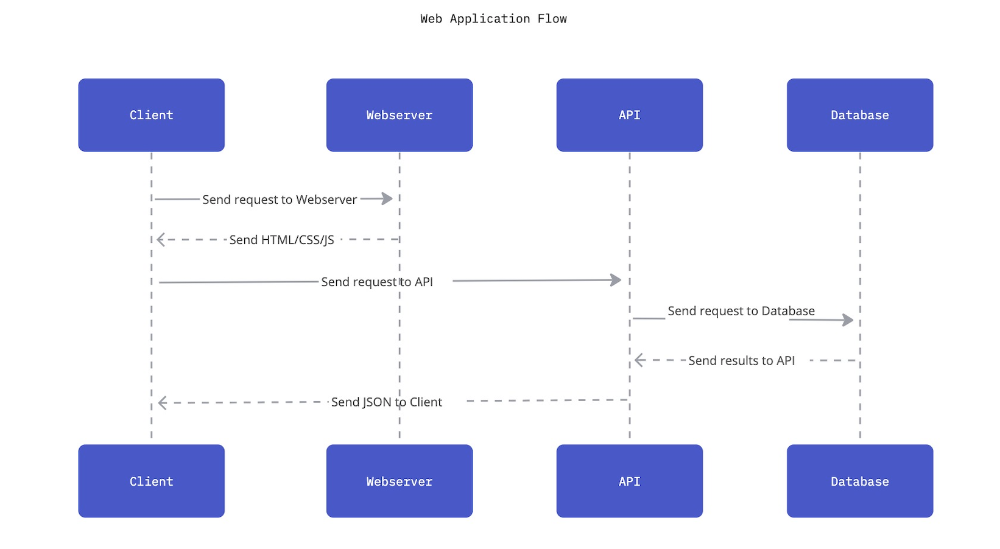

# Fullstack Web App

As a group you'll be developing a full-stack web application that follows the architecture you've seen:

As a sequence diagram:

Since you'll only be working on this for two days, please keep your application as simple as possible (i.e. one db table and one api route).  If you finish early and want to add something, that's fine, but your goal should be to have something that works.

You should decide on a Github repo to use, and make sure everyone on the team has access.  Each team member can always create a repo under their own account when everything is finished.

## Process
You are free to approach this however you prefer.  However, here are some default guidelines
1. Start with the database.  Make sure it works in a container.
2. Then, work on the api.  Make sure the api container works with the database container.  Test it using Postman.
3. Finally, work on the frontend.
4. Once all three components are working on your local machine, you can deploy it to AWS.
